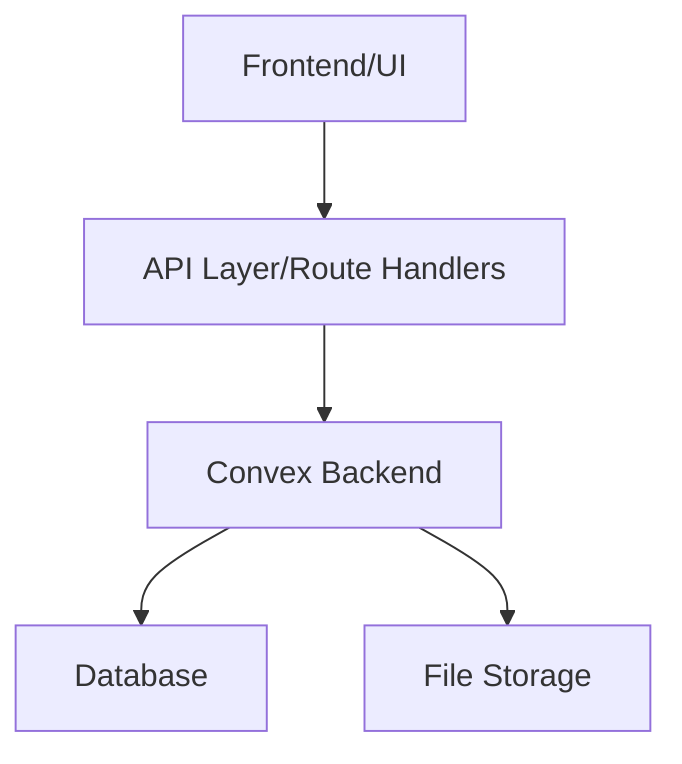
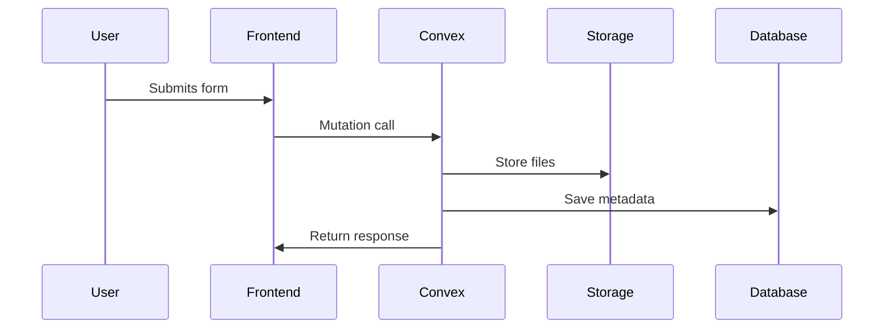

# Podcastr Tools Documentation

## Feature Overview

Podcastr is a comprehensive podcast management platform that empowers creators with essential tools for audio content creation and distribution. Our suite of integrated tools streamlines the podcast production workflow, from initial upload to analytics tracking.

Podcastr provides several tools for podcast management and processing:

- 🎤 Audio Upload & Processing
- 📝 Transcript Generation
- 🔍 Search & Discovery
- 📊 Analytics Dashboard
- 🎨 Thumbnail Generator

## Architecture

### High-Level Overview




### Tech Stack

- **Frontend**: Next.js 14 with App Router
- **Backend**: Convex
- **Storage**: Convex File Storage
- **Authentication**: Clerk
- **Database**: Convex Database

## How It Works

### 1. Form Submission Flow



### 2. Data Processing Flow

1. User inputs are validated on the client-side
2. Form data is sent to Convex mutation functions
3. Backend processes the request and stores data
4. Response is returned to the frontend
5. UI updates with success/error state

## Testing

### Unit Tests

Run unit tests with:

```bash
npm run test
```

### Integration Tests

Run integration tests with:

```bash
npm run test:integration
```

### Manual Testing Checklist

- [ ] Form validation works
- [ ] File uploads complete successfully
- [ ] Data appears in dashboard
- [ ] Search functionality returns expected results
- [ ] Analytics display correctly

## Development Guidelines

1. Always validate inputs both client and server-side
2. Use TypeScript for type safety
3. Follow the established folder structure:
   ```
   /components    # Reusable UI components
   /app          # Pages and routes
   /convex       # Backend functions
   /lib          # Utility functions
   /types        # TypeScript types
   ```

## Error Handling

- Client-side validation using Zod
- Server-side validation in Convex functions
- Proper error messages displayed to users
- Error logging and monitoring

## Performance Considerations

- Optimize file uploads
- Use proper caching strategies
- Implement pagination for large datasets
- Monitor Convex function execution time
